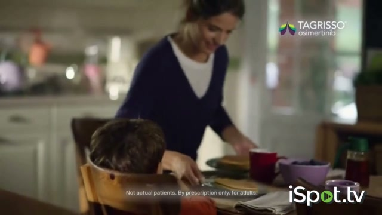
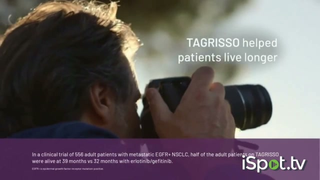

# Tagrisso Commercial Claims and PRO/HEOR Evidence Opportunity

Date searched: July 2, 2026

## Executive Takeaway

The current Tagrisso direct-to-consumer campaign uses a daily-life frame: "TAGRISSO I can..." make pancakes, share handiwork, play dress-up, live longer, and ask for a leading first-treatment option in EGFR-positive metastatic NSCLC. The campaign is a useful example for early-stage HEOR strategy because the most patient-centered commercial language is only partly supported by trial PRO evidence.

The defensible evidence story is not that osimertinib directly enables each depicted activity. The stronger interpretation is that osimertinib has clinical evidence for longer disease control and survival, and PubMed-indexed PRO analyses show delayed symptom deterioration, maintained HRQoL, and manageable patient-reported tolerability in several EGFR-mutated NSCLC settings. A prospective PRO strategy designed earlier could connect these clinical benefits more directly to daily functioning, treatment convenience, role participation, and patient priorities.

## Commercial Inventory and Captured Assets

| Commercial | Source | Captured local assets | Core script or claim language | Notes |
|---|---|---|---|---|
| Tagrisso TV Spot, "So I Can" | [iSpot page](https://www.ispot.tv/ad/TX2H/tagrisso-so-i-can), [official YouTube upload: "Learn More About Available Treatments"](https://www.youtube.com/watch?v=7DIS7T5hHiM), [Fierce Pharma coverage](https://www.fiercepharma.com/marketing/astrazeneca-unveils-first-tv-ad-tagrisso-lung-cancer-treatment) | `ispot_tagrisso_so_i_can.png`; `assets/tagrisso_so_i_can_90s_ispot.mp4`; `assets/youtube_7DIS7T5hHiM_Learn More About Available Treatments.mp4`; `assets/youtube_7DIS7T5hHiM_sddefault.jpg`; claim frames in `assets/claim_frame_90s_*.jpg`; captions in `sources/youtube_7DIS7T5hHiM_Learn More About Available Treatments.en.vtt` | Opens with "Why do I take Tagrisso?" then "TAGRISSO I can make pancakes," "share my handiwork," and "play dress-up." The voiceover describes Tagrisso as a once-daily targeted therapy for adults with NSCLC and certain EGFR mutations when cancer has spread. It states that Tagrisso helped patients live longer. | iSpot lists the ad as a 90-second Rx: Cancer commercial published May 12, 2025. The official YouTube upload date is June 27, 2025. YouTube captions are automated and misrecognize the brand name in places, so brand phrasing was corrected against the video and campaign context. |
| Ten Years of TAGRISSO | [official YouTube upload](https://www.youtube.com/watch?v=fhwjJ4oZqxQ), [MediaPost campaign coverage](https://www.mediapost.com/publications/article/407582/tagrisso-i-can-live-longer-astrazeneca-targets.html?edition=139310) | `assets/youtube_fhwjJ4oZqxQ_Ten Years of TAGRISSO.mp4`; `assets/youtube_fhwjJ4oZqxQ_sddefault.jpg`; `assets/tagrisso_ten_years_15s_frame_*.jpg` | The 15-second spot describes 10 years of Tagrisso since initial 2015 approval, with a decade of research, partnership, and commitment to patients. | MediaPost described the campaign as including a separate 15-second spot without efficacy claims, in contrast with the 90-second spot. The official YouTube upload date is June 27, 2025. |
| Current campaign landing page | [Tagrisso late-stage NSCLC page](https://www.tagrisso.com/late-stage-egfr-nsclc/about-tagrisso.html) | `sources/tagrisso_about_page_screenshot.png`; `assets/tagrisso_lloyd_thumbnail.jpg` | Page hero reads "TAGRIS SO I can play dress-up." It presents clinical-trial claims for Tagrisso alone and Tagrisso plus chemotherapy, including PFS and OS values. | Useful as the current brand-controlled source that connects the campaign phrase to trial-result modules. |
| Adjacent official campaign page | [Tagrisso early-stage NSCLC page](https://www.tagrisso.com/early-stage-nsclc/about-tagrisso.html) | `assets/tagrisso_deb_thumbnail.jpg` | The early-stage page uses the same "TAGRISSO I can" platform around "make pancakes." | Included as campaign-platform context, not as a confirmed TV spot. |

Related branded patient-story videos were identified but not classified as confirmed TV spots in this scan. These include ["TAGRISSO: An Artist's Story"](https://www.youtube.com/watch?v=CPnw9hj1bTY) and ["TAGRISSO: A Musician's Story"](https://www.youtube.com/watch?v=VPvRaB8M4z0). They use similar patient-identity framing, but the confirmed TV-commercial set for this task is the 90-second "So I Can" spot and the 15-second "Ten Years of TAGRISSO" spot.

Representative captured frames:

## Claim-to-Evidence Matrix

| Commercial or website claim | Best PubMed-indexed support found | Evidence strength for commercial daily-life implication | Caveat |
|---|---|---|---|
| "TAGRISSO I can" perform daily activities such as cooking, hobbies, and time with loved ones | In AURA3, osimertinib delayed time to deterioration for chest pain and dyspnea versus platinum-pemetrexed chemotherapy, and more symptomatic patients improved in global health status/QoL with osimertinib, 37% versus 22% ([PMID 29733770](https://pubmed.ncbi.nlm.nih.gov/29733770/)). Patient-reported tolerability also generally favored osimertinib over chemotherapy for fatigue interference and several symptoms in a PRO-CTCAE substudy ([PMID 30032816](https://pubmed.ncbi.nlm.nih.gov/30032816/)). | Moderate for symptom burden and global HRQoL versus chemotherapy. Indirect for specific activities. | AURA3 was the T790M-positive post-EGFR-TKI setting, not newly diagnosed first-line disease. The trials did not measure pancakes, dress-up, handcrafts, or hobby participation as explicit endpoints. |
| "Once-daily pill" and targeted therapy | The commercial and official site describe Tagrisso as an oral, once-daily targeted therapy. Patient-experience evidence is consistent with a less burdensome oral regimen than infusion chemotherapy in AURA3 PRO analyses ([PMID 29733770](https://pubmed.ncbi.nlm.nih.gov/29733770/), [PMID 30032816](https://pubmed.ncbi.nlm.nih.gov/30032816/)). | Moderate for convenience plausibility. | Convenience and daily routine burden require dedicated adherence, treatment-convenience, travel-time, caregiver-time, and preference measures. These were not the primary PRO story in the pivotal publications. |
| "Helped patients live longer" | First-line FLAURA OS favored osimertinib versus erlotinib/gefitinib, with a favorable toxicity profile ([PMID 31838405](https://pubmed.ncbi.nlm.nih.gov/31838405/)). FLAURA2 final OS showed median OS of 47.5 months with osimertinib plus platinum-pemetrexed versus 37.6 months with osimertinib monotherapy ([PMID 41104938](https://pubmed.ncbi.nlm.nih.gov/41104938/)). | Strong for survival in the studied settings. | Survival is not itself a QoL endpoint. It supports the "live longer" claim but does not prove preservation of role functioning or daily activities during the added time. |
| "More time without EGFR+ NSCLC growing or spreading" | FLAURA2 improved PFS with osimertinib plus chemotherapy versus osimertinib alone ([PMID 37937763](https://pubmed.ncbi.nlm.nih.gov/37937763/)). The official site reports median PFS of 25.5 months versus 16.7 months for combination versus monotherapy and median OS of 47.5 versus 37.6 months. | Strong for disease-control outcomes. | PFS is clinically important, but the patient meaning of additional progression-free time depends on symptoms, toxicity, treatment burden, functional status, and patient preference. |
| HRQoL maintained during longer treatment | ADAURA HRQoL was maintained with adjuvant osimertinib, with no clinically meaningful differences versus placebo through week 96 ([PMID 35012927](https://pubmed.ncbi.nlm.nih.gov/35012927/)). The 3-year ADAURA update reported maintained HRQoL and no new safety signals ([PMID 37236398](https://pubmed.ncbi.nlm.nih.gov/37236398/)). LAURA PROs after chemoradiotherapy showed maintained scores without substantial differences in confirmed deterioration across global health/QoL, physical function, fatigue, appetite loss, dyspnea, cough, and chest pain ([PMID 42019226](https://pubmed.ncbi.nlm.nih.gov/42019226/)). | Strong for HRQoL maintenance in adjuvant and post-CRT settings. | These are not metastatic first-line DTC-claim populations. ADAURA used SF-36, a generic instrument, and LAURA is not a symptom-improvement story. |
| Adding chemotherapy preserves QoL while improving outcomes | FLAURA2 PRO analysis found non-clinically meaningful average HRQoL impact in both arms and clinically meaningful cough improvement in both arms. Fatigue and appetite loss worsened during induction in the combination arm, but changes were described as non-clinically meaningful on average ([PMID 41801128](https://pubmed.ncbi.nlm.nih.gov/41801128/)). | Moderate. Useful for balanced discussion of combination therapy. | Monotherapy remains the cleaner daily-life and tolerability narrative. The combination adds chemotherapy burden, higher grade 3 or higher adverse-event rates in the pivotal trial, and a more nuanced PRO story. |
| CNS disease control may reduce patient burden | CNS outcomes favored osimertinib in FLAURA and AURA3 CNS analyses ([PMID 30153097](https://pubmed.ncbi.nlm.nih.gov/30153097/), [PMID 30059262](https://pubmed.ncbi.nlm.nih.gov/30059262/)). FLAURA2 CNS analysis favored combination therapy for CNS progression or death ([PMID 38042525](https://pubmed.ncbi.nlm.nih.gov/38042525/)). | Clinically relevant but indirect for QoL. | CNS progression is highly relevant to functioning and caregiver burden, but these publications are not primarily PRO evidence. A future HEOR plan should predefine neurologic function, cognition, symptom, caregiver, and daily-activity measures. |

## Opportunity for Early-Stage HEOR and PRO Strategy

This case shows a common gap between promotional patient language and the evidence package available at launch or later in the lifecycle. The ad communicates the value of treatment in daily-life terms. The PubMed evidence supports a more technical version of that claim: delayed deterioration, maintained HRQoL, treatment tolerability, and prolonged survival or disease control.

An early PRO strategy could make the bridge explicit before a DTC campaign is needed:

1. Define the intended patient-value claims at the target product profile stage. Examples include staying active, preserving family roles, minimizing treatment burden, maintaining cognitive and social function, and managing symptoms without unacceptable toxicity.
2. Select instruments that can support those claims. EORTC QLQ-C30 and QLQ-LC13 cover global health, functioning, fatigue, dyspnea, cough, chest pain, and appetite loss. PRO-CTCAE can capture patient-experienced tolerability. These could be complemented by treatment-convenience, role-functioning, cognition, work or activity impairment, caregiver burden, and patient-preference modules.
3. Predefine estimands and thresholds that translate clinical outcomes into patient meaning. Examples include time without progression or clinically meaningful symptom deterioration, days alive and out of clinic, time with preserved physical or role function, and net clinical benefit by baseline symptom or CNS-risk subgroup.
4. Plan evidence generation across the lifecycle. Pivotal trials can establish symptom and HRQoL preservation. Early real-world studies can test whether trial benefits translate into daily routines, caregiver time, treatment disruption, and adherence outside the trial setting.
5. Preserve claim discipline. "Patients lived longer" can be supported by OS data. "Patients could return to normal life" requires direct functional, activity, or preference evidence. If the evidence only shows maintained average HRQoL, the claim should remain framed as maintained HRQoL rather than restored normal functioning.

## LinkedIn-Ready Angle

The Tagrisso campaign is a useful HEOR teaching case because the creative idea is patient-centered before the evidence language is. "TAGRISSO I can..." is about life participation. The strongest peer-reviewed evidence is more precise: delayed symptom deterioration versus chemotherapy in AURA3, maintained HRQoL in ADAURA and LAURA, and nuanced FLAURA2 data showing that added chemotherapy improved outcomes without a large average HRQoL decrement but with tolerability tradeoffs.

That gap is the opportunity. Early HEOR teams can help clinical programs anticipate the claims that brands, patients, and clinicians will eventually care about. If a future campaign will talk about cooking, hobbies, family roles, or staying active, the evidence plan should not wait until launch. It should prospectively measure function, symptom stability, treatment burden, caregiver impact, patient preference, and the quality of progression-free time.

## Local File Manifest

| File | Purpose |
|---|---|
| `ispot_tagrisso_so_i_can.png` | Full-page screenshot of the iSpot record for the 90-second spot. |
| `assets/tagrisso_so_i_can_90s_ispot.mp4` | Downloaded iSpot-hosted 90-second commercial video. |
| `assets/youtube_7DIS7T5hHiM_Learn More About Available Treatments.mp4` | Official Tagrisso YouTube version of the 90-second spot. |
| `sources/youtube_7DIS7T5hHiM_Learn More About Available Treatments.en.vtt` | YouTube caption file for the 90-second spot. |
| `assets/youtube_fhwjJ4oZqxQ_Ten Years of TAGRISSO.mp4` | Official Tagrisso YouTube 15-second "Ten Years" spot. |
| `assets/claim_frame_90s_*.jpg` | Selected still frames from the 90-second spot. |
| `assets/tagrisso_ten_years_15s_frame_*.jpg` | Selected still frames from the 15-second spot. |
| `sources/pubmed_osimertinib_pro_cns_efetch.xml` | PubMed efetch XML for key PRO, HRQoL, pivotal clinical-result, and CNS publications cited in the report. |
| `sources/pubmed_osimertinib_pro_efetch.xml` | Earlier PubMed efetch XML subset preserved from the initial PRO search. |
| `sources/tagrisso_about_page_screenshot.png` | Full-page screenshot of the current Tagrisso late-stage NSCLC page. |
| `sources/fiercepharma_tagrisso_first_tv_ad_screenshot.png` | Browser screenshot of Fierce Pharma coverage of the campaign. |
| `sources/mediapost_tagrisso_i_can_live_longer.html` | Local HTML copy of MediaPost campaign coverage. |
| `assets/youtube_7DIS7T5hHiM_sddefault.jpg` | Official YouTube thumbnail for the 90-second spot. |
| `assets/youtube_fhwjJ4oZqxQ_sddefault.jpg` | Official YouTube thumbnail for the 15-second spot. |
| `assets/tagrisso_deb_thumbnail.jpg` and `assets/tagrisso_lloyd_thumbnail.jpg` | Official Tagrisso.com campaign thumbnails for adjacent "TAGRISSO I can" page examples. |

## Search Notes and Limitations

- The commercial search identified two campaign spots: a 90-second "So I Can" spot and a separate 15-second "Ten Years of TAGRISSO" spot. iSpot exposes structured metadata and video metadata for the 90-second spot. Official YouTube uploads were used to corroborate the 90-second and 15-second assets.
- Automated YouTube captions contained brand-name recognition errors. The report therefore records short excerpts only, using the visible and contextual brand phrase "TAGRISSO I can" rather than the raw caption misrecognitions.
- The PubMed search focused on osimertinib, Tagrisso, patient-reported outcomes, health-related quality of life, EORTC QLQ-C30, QLQ-LC13, PRO-CTCAE, AURA3, FLAURA, FLAURA2, ADAURA, and LAURA.
- This is not an MLR-ready claims review. It is an opportunity scan for HEOR and PRO strategy. Any promotional use would require label, fair-balance, substantiation, and review under the sponsor's medical, legal, and regulatory process.
